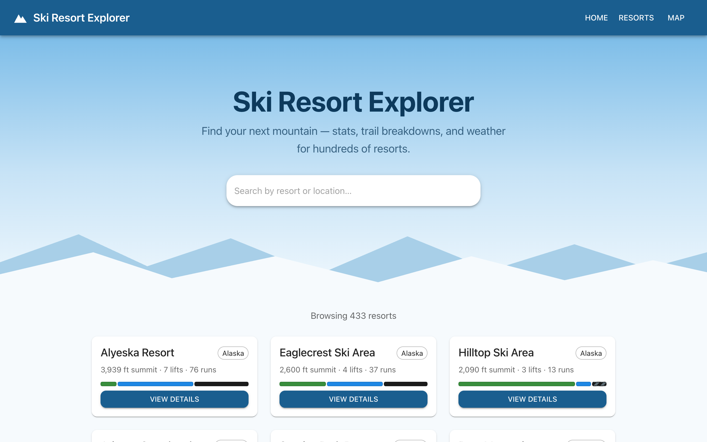
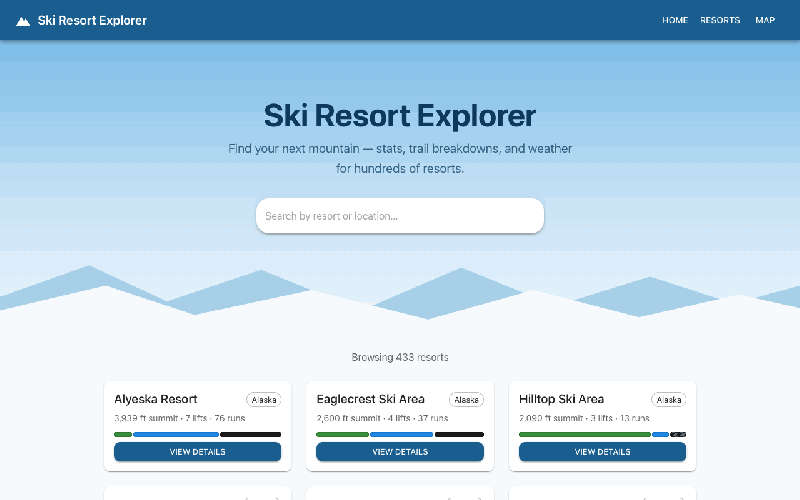

# Ski Resort Explorer

A full-stack web app for exploring ski resorts — browse resorts on an interactive map and compare stats like summit/base elevation, lifts, runs, and trail difficulty breakdowns.



## Demo

Search, the interactive resort map, and a resort detail page with live weather:



## Tech stack

- **Frontend** ([client/](client)): React 19 + Vite, Material UI, React Router, Leaflet maps
- **Backend** ([server/](server)): Flask REST API backed by MySQL, plus a server-side proxy for OpenWeather (current conditions and radar tiles) so the API key never reaches the browser

## API endpoints

| Endpoint | Description |
| --- | --- |
| `GET /api/resorts` | All ski resorts. Optional filters: `?q=` (case-insensitive substring match on name or location) and `?state=` (exact location match), e.g. `/api/resorts?q=vail` or `/api/resorts?state=Utah` |
| `GET /api/resorts/<id>` | A single resort by ID. Returns `404` for a malformed or unknown id |
| `GET /api/weather?lat=<lat>&lon=<lon>` | Current conditions from OpenWeather (imperial units), proxied server-side |
| `GET /api/weather/tiles/<z>/<x>/<y>.png` | OpenWeather precipitation radar tile for the detail-page map, proxied server-side |

The weather endpoints return `503` if `OPENWEATHER_API_KEY` is not set, `400` for invalid coordinates, and `502` if OpenWeather is unreachable. The upstream status is logged on the server but never exposed to clients.

## Running locally

### Database

Requires a local MySQL server. Create the database and import the included dump (schema + all resort data):

```bash
mysql -u root -e "CREATE DATABASE SkiResorts"
mysql -u root SkiResorts < server/skiresorts.sql
```

### Backend

```bash
cd server
cp .env.example .env   # then fill in your OpenWeather API key
pip install -r requirements.txt
python main.py         # runs on http://localhost:8080
```

Server environment variables (in `server/.env`, see [server/.env.example](server/.env.example)):

- `DB_HOST`, `DB_USER`, `DB_PASSWORD`, `DB_NAME` — MySQL connection (defaults to a local database named `SkiResorts`)
- `OPENWEATHER_API_KEY` — OpenWeather key for the weather panel and radar map. It is only ever read by Flask; the React app calls the `/api/weather` routes and Flask forwards the request upstream. Without it the app still runs, but the resort detail page shows a weather error instead of conditions.
- `CORS_ORIGINS` — optional, comma-separated. Leave unset for local development: the Vite dev server proxies `/api` to Flask, so the browser never makes a cross-origin request. Set it only when a separately hosted frontend calls the API directly.
- `FLASK_DEBUG` — defaults to `1` (debug reloader on). Set to `0` to run without it.

### Frontend

```bash
cd client
npm install
npm run dev            # runs on http://localhost:5173
```

In development the Vite dev server proxies every `/api/*` request to Flask at `http://localhost:8080` (see [client/vite.config.js](client/vite.config.js)), so the React app uses relative URLs and no CORS setup is needed.

Client environment variables (optional, in `client/.env`, see [client/.env.example](client/.env.example)): `VITE_API_BASE_URL`. Leave it unset in development unless Flask runs on a different host or port, in which case the proxy target follows it. For a production build set it to the public API origin, since there is no proxy in front of `dist/`. Never put the OpenWeather key here; anything prefixed `VITE_` is compiled into the public JavaScript bundle.